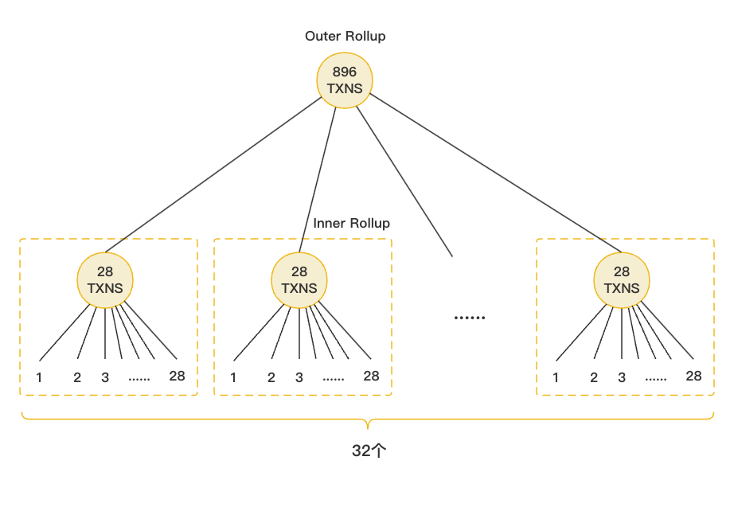

# Rollups

## 什么是Rollups？

Rollups是基于Layer 2的扩容技术，L2 Rollup指许多与以太坊主网平行运行但同时继承以太坊本身的可用性和完整性的第三方扩容方案，它允许交易在一个并行单独的区块链上执行。

Rollups的扩容原理是将数百个已处理的交易汇总成一个批次，并在与以太坊主网平行的L2链上按批次执行交易，最终完成的交易再按批次一次性发布到底层（Layer 1）区块链，以此来提升交易速度，降低交易燃料费。

Rollups主要有两个方案：Op Rollup和ZK Rollup。他们执行原理差不多，主要区别在于交易验证过程。

## Op Rollup

Op Rollup全称为Optimistic Rollup。Optimistic扩容方案是基于“乐观”机制的，采用的是**欺诈证明**（Fraud proofs），即系统乐观的相信交易数据的正确性，数据不经过有效验证，但会直接进入一个等待期，等待期里如果有任何节点提出异议并佐证恶意交易，则交易取消；若无异议，等待期结束，交易自动完成并写入区块。这种“欺诈证明”方案不需要在每笔交易中部署验证，大大节省了网络计算资源跟成本，同时也保证了及时的最终确定性。

Op Rollup比较突出的两个方案是**Arbitrum**和**Optimism**。这两个方案在结构上差不多，关键区别在于他们的防欺诈逻辑，以及未来处理兼容性问题的方式上也略有差异。

### Optimism

**Optimism采用的是单轮非交互式欺诈证明**。L2 验证人将压缩后的数据同步到 L1 ，同时质押保证金，如果有人对该Rollup区块的交易数据存在争议，则需发起挑战且同样质押保证金。然后Rollup协议将在L1链上重新计算该区块中所有交易来判定对错。错误方的保证金将被罚没，正确方将获得奖励。

这个方案的优点在于：只需进行一轮交互，它在设计上要简单得多，并消除了有关各方之间协调的需要，使欺诈证明瞬间完成，所需时间更短。

缺点是：虽然相对于以太坊主链的成本要少很多，但是相对于交互式最终的单一性计算，其链上计算的成本要更高，甚至如果需要重新计算的交易过多，可能还会受到 L1 区块大小（gas limit）的限制。

### Arbitrum

**Arbitrum采用多轮交互型欺诈证明**。L2的验证人将压缩后的数据同步到L1，同时质押保证金，如果有人对该 Rollup区块的交易数据存在争议，则需发起挑战且同样质押保证金。验证人和挑战者在链下通过二分法的方式不断拆分存在争议的步骤，直至将争议范围缩减到一个具体的步骤，再到L1链上对该步骤进行判定，以此高效解决争议。

这种方式的优点：因为只验证单步，不面临这种限制：gas limit限制，并且能以较低的成本在链上解决争议。采用多轮交互型设计也使 Arbitrum 可以更容易支持复杂的智能合约，在复杂的以太坊生态应用中互操作性更高。

多轮交互型设计的相对缺点：由于增加了交互次数，对应的争议窗口设计相较于单轮交互型设计也更长更复杂，并且交互式欺诈证明需要多方合作来剖析挑战，需要更长的时间来解决。

## ZK Rollup

**零知识证明**（Zero-Knowledge Proof，ZKPs）是一种证明方法，通过这种方法，一方（证明者）可以在不透露任何实际信息的情况下，向另一方（验证者）证明它知道一个秘密或一个声明是真实的。这个概念在1980年被麻省理工学院的研究人员引入，人们一直认为 ZKPs 过于复杂，幽默地称其为“月亮数学”。

ZK Rollup 即通过零知识有效性证明的扩容方案。其特点是所有计算在链下进行，链上存储，参与计算的明文数据通过calldata的形式发送到链上合约，降低存储成本。同时，链下计算的正确性由零知识证明算法保证。该方案能大幅提高TPS，也能降低单次交易的费用。

ZK Rollup可以即时验证有效性，保证了不可能在一批交易中加入无效交易。若使用Op Rollup则需等待7天。

### <u>Loopring</u>

Loopring是基于以太坊区块链的去中心化交易所（DEX）的第二层扩展协议，每秒可以处理数千笔交易的结算。Loopring技术可作为协议层在DEX中使用，该平台还提供Loopring Exchange，这是一个非托管交易平台，可提供安全、高速的交易，且不收任何燃料费。

Loopring利用零知识证明允许构建高吞吐量、非托管的去中心化交易所。Loopring还使用了其原生LCR代币奖励零知识卷叠运营商和流动性提供者。

### <u>Aztec</u>

Aztec是L2中的一个项目，其实现了隐私交易。其体系为：基于底层的PLONK证明系统，实现账目间的匿名交易，并通过网关合约的嫁接来实现和DeFi项目的隐私交互。

在Aztec的数据结构中所有票据的状态存储在两个Merkle Trees中，其中一个是**note tree**（票据树），存储着所有生成过的票据，另一个则是**nullifier tree**（废弃树），存储所有被销毁过的票据。所谓“拥有”一张票据，即在 note tree 中存在对应票据、而在nullifier tree中不存在对应票据。

当用户要进行一笔交易时，需销毁并生成相应的票据，再将票据所有权转移。而对于这笔私密交易，用户需要在本地生成一个“隐私证明”。随后，28笔私密交易将会聚合为内部Rollup证明，之后又有32个这样的内部Rollup证明聚合为外部Rollup证明。外部Rollup证明将会最终被提交到L1上，供节点验证。也就是说，一个最终提交的Rollup证明中可以包含28*32=896笔交易。

Aztec的优势在于：其实现了安全级别较高、且能够和DeFi项目交互的隐私功能。

然而特殊的隐私功能也很大程度上限制了项目：一方面Aztec依靠集成网关合约来实现对 DeFi项目的操作，在降低部署难度的同时也降低了灵活性，短期来看更适合操作单一、资本密集的项目；另一方面，为了实现隐私，要求给每一笔交易都生成隐私证明，虽然项目通过双层Rollup方式分摊了存储空间，但 Aztec 的手续费在所有 L2 中仍然是最高的，对用户而言门槛也较高，更适合大户。

### <u>Hermez</u>

Hermez是一个基于ZK技术的去中心化L2 Rollup解决方案。

Hermez有两个版本：1.0是一个支付平台，目前正在运行；2.0正在开发，将把完全兼容的 zkEVM 带到以太坊。

#### Hermez 1.0

Hermez以ZK Rollup开局，专注于扩展以太坊上的支付和代币转移。简单来说，就是将一批交易放在链外执行。

Rollups 使用以太坊进行数据存储而非计算。Rollup 不是在以太坊上把交易一个个地依次地执行，而是把一批交易（包含成千上万个交易）在链外一次性执行。

当这些成千上万的交易在链外被执行时，在 Hermez 的情况下，会产生一个 ZK-SNARK proof，用来证明在链外执行的成千上万的交易是正确的。SNARK proof 证明了该批交易的有效性，这意味着不需要以太坊验证每一笔交易，只需以太坊验证证明。

在Hermez上，可以进行三种不同的交易：

* **存款**：从 L1 以太坊发送任何 ERC-20 代币到 L2 Hermez。需支付燃料费。

* **转账**：将任何 ERC-20 代币从一个 Hermez 账户发送到另一个 Hermez 账户。这非常便宜且即时进行，发送和接收资金时，可复制和粘贴地址，也可以生成一个二维码以方便扫描。

* **提款**：把 ERC-20 代币从 L2 Hermez 送回 L1 以太坊。需支付燃料费。

#### Coordinators

Coordinator（协调人）是 Hermez 的区块生产者，他们负责生成 ZK-proof，以证明用户在链外进行的交易的有效性。Coordinator 把用户的交易请求放在一个批次里，然后生成一个 ZK-proof，这个 ZK-proof 将由以太坊上的智能合约来验证。

如何成为一个 Coordinator 呢？Hermez 被认为是去中心化的原因是任何人都可以成为 Coordinator ，并通过相应的服务赚取奖励作为回报。网络上可以同时有任意数量的 Coordinator ，但是只有一个人能够在给定的时间间隔（10分钟）中处理交易并获得奖励。

Hermez 通过拍卖机制选择其下一个时间间隔的 Coordinator 。任何人都可使用 MATIC 代币出价，出价最高者赢得在下一个 10 分钟内处理交易的权利。Coordinator 在这 10 分钟内会尽可能多地处理交易，使他们的回报大于他们的出价。

如果你赢得了竞标，那么你用来投资的资金有30%被永久销毁、40%用于由以太坊基金会管理的捐款账户、30%用于网络奖励，以帮助推动Hermez网络的进一步采用。

#### Hermez 2.0

在EthCC 4会议期间，Hermez团队宣布准备开发zkEVM：Hermez 2.0。在这之后不久Polygon对其进行了并购。

zkEVM 非常重要，因为以太坊要扩大规模就需要智能合约能在链外运行，这正是 zkEVM 所要做的：**在 ZK-Rollup 上运行智能合约**。

Hermez方法的好处在于：在工具、生态系统和安全方面可以与以太坊完全兼容，即智能合约将能够在 ZK-Rollup 上运行，且无需对代码进行太多改动。理想情况下，在 L1 以太坊上运行的智能合约能在 L2 Hermez 上运行，开发者也不必在意智能合约是为 L1 链还是为 L2 链编写的。

Hermez 1.0 使用 SNARK-proofs，在 2.0 中他们同时使用 SNARK-proofs 和 STARK-proofs，以获得最佳的效率和证明生成时间。

### <u>zkSync</u>

zkSync是一条以太坊L2公链，使用ZK Rollup技术来解决以太坊当前的扩容性问题。目的是增加以太坊的吞吐量，而且要保证其自由和去中心化的性质。

在zkSync中，计算是在链下执行的，大多数数据也存在链下。由于所有交易都在以太坊主链上进行验证，因此用户享有与以太坊相同的安全级别。

#### zkSync 1.0

即**zkSync Lite**，于2020年6月15日在以太坊主网上启动。实现了约300TPS的交易吞吐量，但是不兼容EVM。

#### zkSync 2.0

即**zkSync Era**，于2023年3月24日启动，首先，通过支持 Solidity（通过 zkEVM）和 Zinc（rollup 的内部编程语言）实现任意智能合约功能；其次，通过 **zkPorter**（一种结合了 zkRollups 和分片的协议），吞吐量呈指数级增长，达到 20000+ TPS。

#### zkSync 1.0和zkSync 2.0的主要区别：

* **智能合约支持**：zkSync 1.0 主要关注简化的支付和资产转移场景，而不支持以太坊虚拟机（EVM）兼容的智能合约。相反，zkSync 2.0 提供了对 EVM 兼容智能合约的完全支持，这意味着开发者可以轻松地将现有的以太坊智能合约部署到 zkSync 2.0。
* **可组合性**：zkSync 1.0 仅支持有限的跨合约交互，而 zkSync 2.0 通过保留关键 EVM 功能（如智能合约可组合性）提高了协议间互操作性。这使得 zkSync 2.0 更适合构建复杂的去中心化金融（DeFi）应用程序。
* **账户抽象**：zkSync 2.0 引入了账户抽象的新功能，简化了用户和智能合约之间的交互。账户抽象允许用户使用任何签名方案与智能合约进行交互，从而提高了用户体验。
* **更强大的开发工具**：zkSync 2.0 配备了一整套开发工具，包括 CLI（命令行界面）和 SDK（软件开发工具包），使开发者能够更轻松地构建和部署基于 zkSync 的应用程序。

#### Matter labs

Matter labs是zkSync背后的公司。这是一家来自德国的公司，由 CEO Alex G. 于 2018 年创立，现已发展到 50 多名员工。该团队由经验丰富的开发人员、研究人员和企业家以及沟通方面 Zoe Gadsden (COO)、Ankur Rakshit (CFO)、Steve Newcomb (CPO) 和 Shazia Hasan 等核心成员组成。他们齐心协力创造一种更高效、更具成本效益且更安全的以太坊交易方式。

### <u>ZKSwap</u>

ZKSwap是一个基于ZK Rollup技术的以太坊L2层去中心化交易所。

由 ZKSwap 提出的 L2 扩容方案叫做 **ZKSpeed**。

ZKSpeed 方案中，对链下数据分为两部分：所有和 L1 交易相关的数据都会实时上链，保证资金的安全性，并实时生成零知识证明和验证证明；对于仅仅和 L2 相关的交易采用分布式存储的方案，实时披露原始交易数据，并把数据摘要实时上链。目前数据摘要由L2运营方自己发布，并且任何人可以实时验证该摘要的准确性，长期来看，数据摘要的计算和发布可以通过分布式的形式进行，并引入社区验证。ZKSpeed 方案对链下数据进行了分类，大幅度提高了数据的可扩展性。

为了提高系统处理速度，ZKSwap团队提出了名为**聚合证明**的解决方案。

聚合证明（Proof of Aggregative）的逻辑非常简单。在基础的以太坊扩容方案里，一个区块对应一个有效性证明，链上合约验证证明的有效性。如今以太坊平均出块速度为15s一个区块，如果链上一次能验证多个区块的有效性，那么平摊在每个交易上的成本将大幅减少。因此聚合证明把一段时间内，或者固定数量的区块产生的多个证明用零知识证明的方式去证明这些区块的证明是有效的。这样链上只需要一次验证，就可以实现多个区块证明的有效性验证。

### <u>Scroll</u>

Scroll是以太坊上基于zkEVM的ZK Rollup，作为L2解决方案用于解决以太坊的拥堵问题。Scroll创立于2021年，致力于创建一个EVM（以太坊虚拟机）等效的ZK Rollup，以实现更好的兼容性。

Scroll项目的最大特色和优势即是实现字节码（ByteCode）级别的zkEVM兼容。其字节码兼容性意味着Solidity、Vyper和Huff可直接使用，无需重新审核，并且大多数现有工具都是继承的，同时有与以太坊几乎相同的UX和DevX。

EVM等效是Scroll被看作“原生”性质的体现。与zkSync相比，zkSync只实现语言兼容，而Scroll正实现“原生”兼容。zkSync虽然已经开始支持一些通用功能了，但在开发语言上，它们还不能很好地做到EVM兼容（zkSync虽然实现了Solidity兼容，但底层用的仍是不同的虚拟机）

然而目前Scroll项目的生态部署还比较稀少，这意味着在生态项目合作上，更多第三方项目选择zkSync，认同其在基础设施建设、资金体量及相对完整的生态链方面更具优势，这是Scroll的不足之处。

#### 发展成果

* 2022年8月，**Scroll启动了Pre-Alpha测试网**，得到超过了100000名用户社区的支持。到目前为止已处理了超过15400000个交易并证明了1800000个块。有超过641000批次被提交作为有效性证明，并由Scroll在L1上的Rollup合约进行最终确认。
* 2023年2月27日，**Scroll团队宣布Alpha测试网已经在Goerli上线**，标志着Scroll发展历程中一个重要时刻，意味着开发人员在Scroll网络部署应用程序完全无需许可，任何人都可以尝试使用Scroll技术并将其推向极限。
* 在ZK领域，**Scroll实现了新的三层聚合电路原型**，降低了Solidity验证者合约的燃料成本。

### <u>StarkNet</u>

StarkNet是由StarkWare团队所打造的一条基于ZK Rollup技术的以太坊L2层区块链，其优点是能够能够让应用在链上进行高效能的运作也无需担心会危害以太坊网络的安全。

StarkNet使用的编程语言是由StarkWare团队开发的**Cario**语言。

优点在于：StarkNet同时兼顾隐私以及扩展性，尤其是保护用户的交易资料的隐私以及数据安全部分；同时，StarkNet具有账户抽象功能，通过用户的生物特征便可简单使用钱包，而不用繁杂的注记词和私钥。

缺点在于：由于还在发展初期，目前StarkNet区块链网络最大的问题就是交易确认的时间过长，往往一个交易需要数分钟的时间确认。因此其生态的发展和技术的成熟仍需要时间。

#### 特点

* StarkNet是一个无许可制的L2网络，任何人都可以在链上通过特定的程式码来部署属于自己的合约
* 由于L2扩展方案本身的安全性是继承以太坊主链的，因此无需牺牲安全性也可以使整个网络的交易效率更高
* StarkNet所使用的zk-STARK为零知识证明系统中的一种，STARK生成交易证明的环境安全可信，并且用于计算证明的工作量比以太坊小非常多，因此扩展性也高。
* StarkNet和zkSync等跨Rollup链的服务将会越来越重要，将会大幅降低链上流动性提供者的风险
* 即使StarkNet本身是不兼容EVM的（如BNB Chain、Polygon等），但是以太坊应用将可以通过Kakarot把以太坊上的应用更快地部署到StarkNet网络上

### <u>Taiko</u>

Taiko的目标是成为一个**完全等同于以太坊的ZK Rollup**（也就是zkEVM），并通过支持去中心化、无许可和安全的L2架构中的所有EVM操作码来扩展以太坊。

Taiko主要由三个主要部分组成：**zkEVM电路**（用于生成证明）、**L2 Rollup节点**（用于管理Rollup链）和**L1上的协议**（用于将这两部分连接在一起以进行Rollup协议验证）。

* 通过生成zkEVM电路的有效性证明，Taiko实现了一个能够支持每个EVM操作码的zkEVM。除了与以太坊L1智能合约和Dapp完美兼容外，所有以太坊和Solidity工具都可以与Taiko无缝协作，无需中断开发人员的工作流程。这使得Solidity智能合约开发人员能够毫无摩擦地在Taiko使用Solidity语言进行开发，无需浪费时间来适应新的开发环境，也避免了因引入一种不同的语言而产生对以太坊上已运行的智能合约以及Dapp造成风险
* Taiko节点从以太坊获取交易数据并在L2上执行交易，根据最终交易执行情况推进状态。目前Taiko节点是一个以太坊Geth分叉，节点管理Rollup链
* Taiko Protocol将坚持安全、去中心化和无需许可的核心原则，来定义执行Rollup规则和潜在参与者资格。部署在以太坊L1上的智能合约可以充当zk-SNARK证明的数据可用性机制和验证者，同时部署在Taiko L2上的智能合约执行某些重要协议功能

#### 运作过程

Taiko L2 中的区块由按顺序执行的交易集合组成，通过将新区块附加到链上来更新其状态，同时遵循交易执行的协议规则来计算。

区块提交分为两部分：

- **区块提议**：区块被提议后，区块数据将发布在以太坊上，同时区块将附加到 Taiko L1 合约的提议区块列表中。该协议确保区块在这一点上是不可变的，这意味着区块执行是确定性的，因此任何人都可以计算执行后的区块链状态。我们将一个区块提议和所有封闭的交易视为提议完成。L1 上提议区块的一个显着特征是，可能存在将被 Taiko L2 节点跳过的无效交易，但 Taiko L2 允许在同时提出多个块时进行容错。
- **区块验证**：因为所有提议的区块都是确定性的，所以可以进行并行证明。一旦验证了该区块的证明，在其正确链接的父块被最终确定后，我们将该区块标记为链上最终确定。

### <u>Linea</u>

Linea是一个由Consensys公司开发的兼容EVM并采用Zk Rollup技术的L2解决方案。

Linea作为一个EVM兼容采用Zk Rollup的以太坊二层，和zkSync、StarkNet等采用ZK技术的二层解决方案相比，大的方向上并没有太大的差异，基本都是围绕区块链不可能三角来去展开，提升可扩展性，降低燃料费等方面去做尝试，但是背景上，由于其背后的母公司Consensys拥有庞大的资源，并且其在加密领域也拥有众多的区块链解决方案，最被大众熟知的当属Metamask，所以，一经推出就受到大众的关注。

#### 特点

* Linea是EVM字节码等价的，由于EVM规范仍在不断发展，因此能够快速匹配不断变化的生态系统
* Linea将零知识证明与完整的以太坊虚拟机等效性相结合，允许构建者创建可扩展的Dapp或迁移现有的Dapp，而无需更改代码或重写智能合约

#### Linea的使用

1、使用跨链桥。 2、账户之间的转账。 3、使用DEX以及提供流动性。  4、部署合约。

***

参考文章：

1.https://medium.com/@pedronv

2.https://www.panewslab.com/zh/articledetails/N5292808.html

3.https://foresightnews.pro/article/detail/8086

4.https://www.panewslab.com/zh/articledetails/uvvz64kvyb0p.html

5.https://cryptowesearch.com/blog/all/layer2-starkware-starknet

6.https://mp.weixin.qq.com/s/X5IqZ5wVD9D7z77bN85TcA

7.https://foresightnews.pro/article/detail/16223

8.https://www.panewslab.com/zh/articledetails/5u377m52i4f5.html